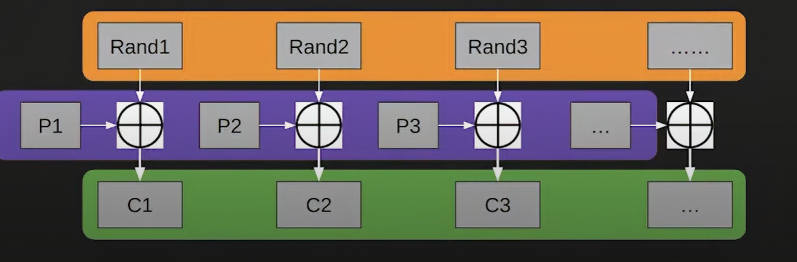
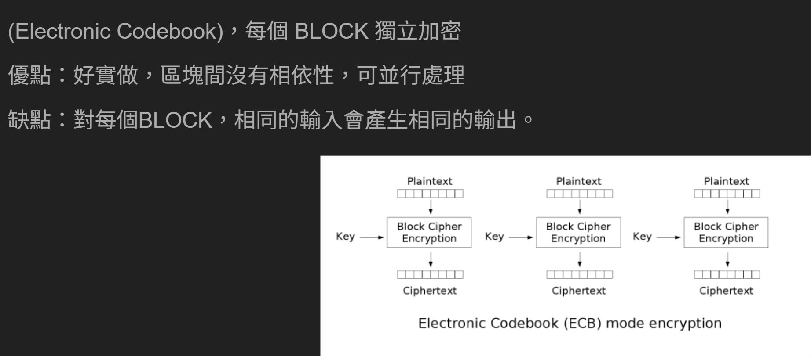
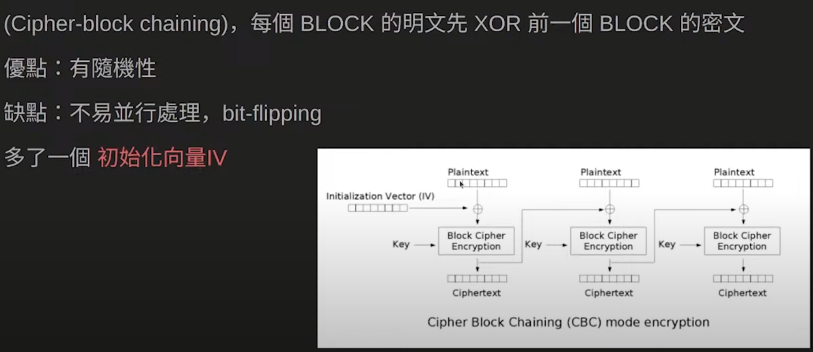
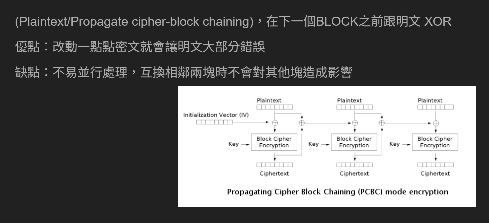
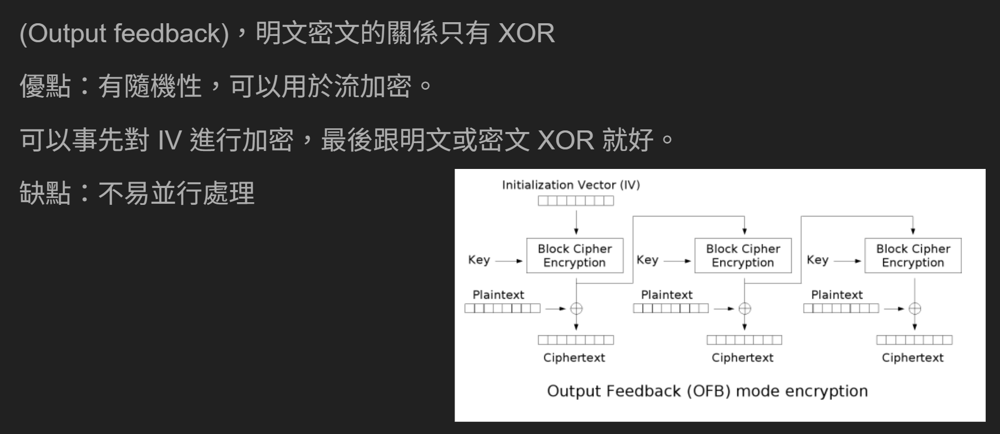
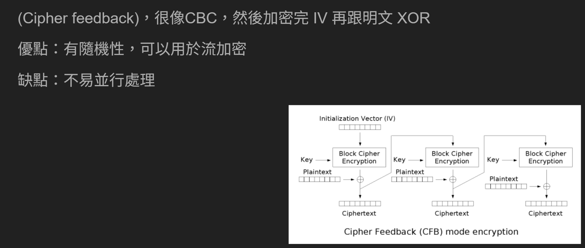
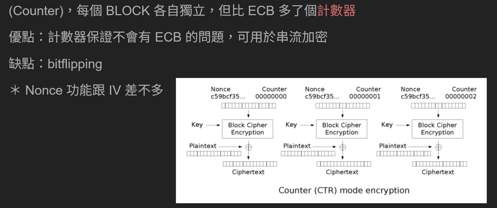
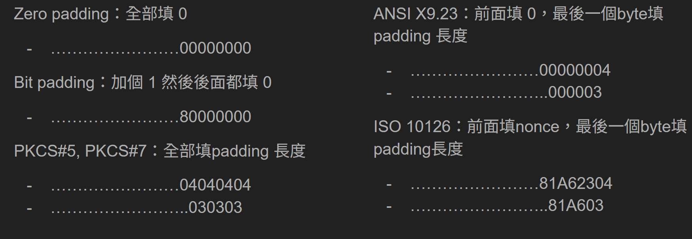

# Crypto

## 編碼

### UTF-8（Unicode Transformation Format - 8-bit）
- 使用1到4個bytes來表示字符。
- 容納了各國語言。是Unicode的一種實現。
- ASCII字符使用一個位元組表示，而其他字符使用更多位元組。ASCII能表示的，用UTF-8編碼是一樣的結果。

### HEX
### Base64
### ASCII
## 古典密碼
### Caesar Cipher

- 加密
    - 選定使用大小還是小寫、偏移量
    - 把明文中所有英文字母轉成選地大寫或小寫
    - 按照設定的偏移量更改字母
- 解密
    - 按照設定的偏移量更改字母
- 因為英文只有 26 個，所以偏移量 0 和 26 可以歸為一種偏移量，所以偏移量可以歸為只有 0 ~25 這26種可能，那暴力常是每一個偏移量，然後看看哪一種比較像明文就可以知道怎麼

### 頻率分析

## Symmetric-key algorithm

### Symmetric-key algorithm

- 對稱密碼加密
- 加解密使用同一把金鑰
- 加解密的速度快

### Stream cipher
- 像流水一樣，一次加密一個bit或是一個byte
- 用一個亂數器生成許多數字來加密，亂數器是重點
- 密鑰通常是亂數器的 seed
- 使用XOR加密

**Synchronous stream cipher**
- RC4 (Rivest Cipher)

### Keystream 生成算法

**偽隨機數 PRNG**
- 知道了seed ，基本上就知道整個數列了
- 函數大都具備「有限狀態空間」，當狀態開始重複時，數列開始循環
- 週期：對於所有可能的 seed ，生成的數列循環長度最小的

**OTP(one time password)**
- RNG (Random Number Generator)
- 一次性密碼本，必須是 Truly Random 產生
- 理論上被證明具有完善保密性
- 密碼至少要和資料一樣長
- 只能被用一次，用完就要丟
- 傳輸密碼本的通道必須安全

**LCG** 

公式：Xn+1 = (aXn + b) mod m
加密方法
- 線性同餘方法
- 運算速度快、易寫、佔用記憶體少

解密：
通常在式a, b, m等未知數都不知道時

思路：需要先求出 m
如果能拿到足夠多 m 的倍數 m1, m2, m3…
gcd(m1, m2, m3, …) 大概率會算出 m
先找到 m 的倍數 (需要消掉 a)
t0 = x0 - x1 (mod m)
t1 = x1 - x2 = a * (x0 - x1) = a * t0 (mod m)
t2 = x2 - x3 = a * (x1 - x2) = a * t1 (mod m)
→ t0 * t2 - t1 * t1 = t0 * (a2 * t0) - (a * t0) * (a * t0) = 0 (mod m)
生出一堆 m 的倍數
m1 = (x0 - x1) * (x2 - x3) - (x1 - x2) * (x1 - x2)
m2 = (x1 - x2) * (x3 - x4) - (x2 - x3) * (x2 - x3)
m3 = (x2 - x3) * (x4 - x5) - (x3 - x4) * (x3 - x4)

**FSR**

**Mersenne Twister 梅森旋轉算法**
生成亂數方法
- 輸入 seed 擴展成 624 個 state
- 以舊的 state 生成下一輪 state
- 取 state 值加料後輸出隨機值
- state 用完了從第二步驟重複

破解方法
- 蒐集 624 個連續的 random 值
- 輸入成 624 個 MT state
- 算出之後每輪的 MT state
- 預測接下來的所有 random 值

**/dev/radnom**
- 類UNIX系統中是一個特殊的裝置檔案，可以用作亂數發生
- 

### AES
AES主要有128bit(16bytes)blocks和128bit的key，被稱為 AES-128

**暴力破解128bits 的金鑰多困難?**
如果將整個比特幣挖礦網路的力量用於 AES-128 金鑰，那麼破解該金鑰需要花費宇宙年齡的一百多倍。
人們推薦使用 AES-256 的原因之一，儘管它的性能較差，但因為在量子未來它仍然可以提供非常充足的 128 位元安全性。

**AES 運作原理**

1. 密鑰擴展
2. 初始密鑰加法
3. 回合(重複進行10次)
   - SubBytes：這是一個替換步驟，其中每個狀態矩陣中的字節都會根據一個查找表（稱為“ S-box”）被替換成另一個字節。
   - ShiftRows
   - MixColumns
   - AddRoundKey

**Block mode**
- 把明文分成許多個等長的 Block 的加密方法

**ECB mode:**
將要加密的東西分成不同的block，每個block有可能是16bits, 32bits或是64bits，每個block都加密後隨便組合 

**CBC mode**

**PCBC mode** 

**OFB mode:**

**CFB mode:**

**CTR mode**

**常見padding**

## DATA FORMATS

### PEM

### DER 

## Hash

### 什麼是雜湊函數
- 多對一
- 不可逆
**用途**
- 文本比對
- 驗證密碼

## 非對稱式密碼(RSA)

加密的鑰匙，和解密的鑰匙不一樣，有一個公鑰和私鑰

發明者：
Ron Rivest
Adi Shamir
Leonard Adleman
密鑰長度：2048~4096 bits
數學難題：質因數分解

### 擴展歐幾里得算法(貝祖定理)

### 費馬小定理

### 歐拉定理

