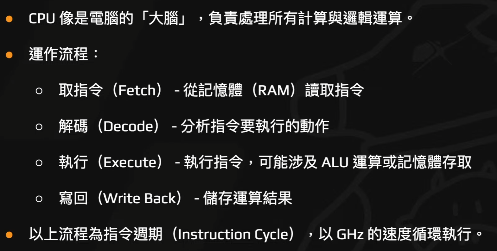

# 我獨自逆向:Reverse - 課程筆記

### **第二部分：逆向工程核心概念**

#### **逆向工程介紹 (Introduction to Reverse Engineering)**

* **廣義定義:** 理解某個事物（軟體、硬體、遊戲等）的內部運作原理。
    * 應用範疇：惡意程式分析、軟體授權破解、開發硬體替代零件或遊戲插件等。
* **狹義定義 (本課程焦點):**
    * 將高階程式語言編譯後的機器碼或組合語言，逆向推導回原始的程式邏輯。
    * 主要流程：高階語言 -> (編譯) -> 組合語言 -> (組譯) -> 機器碼。逆向工程則是反向操作。
* **為何學習:** 提升安全性、學術研究、改進與創新、恢復遺失的資料。
* **如何進行:**
    * **靜態分析:** 在不執行程式的情況下分析其程式碼、結構與資源。
    * **動態分析:** 在程式執行時觀察其行為、記憶體變化與系統互動。
* **本課程聚焦:** 以 C/C++ 編寫、基於 x86 指令集架構的應用程式逆向工程。

#### **執行檔分析 (Executable File Analysis)**

* **常見格式:**
    * **ELF (Executable and Linkable Format):** Linux, Unix-like 系統。
    * **PE (Portable Executable):** Windows 系統 (.exe, .dll)。
    * **Mach-O (Mach Object):** macOS, iOS 系統。
* **ELF Header:**
    * 作業系統透過讀取檔案的 Header 來了解其格式與執行方式。
    * Header 包含魔術數字 (Magic Number) `7f 45 4c 46` (.ELF)，以及程式的進入點位址 (Entry point address)、架構 (e.g., x86-64)、Program headers/Section headers 的位置等資訊。
* **Program Header:**
    * 描述作業系統如何將檔案載入記憶體，定義了多個 Segment (如 LOAD, INTERP)。
    * 每個 Segment 都有指定的虛擬位址 (VirtAddr) 和權限 (Read, Write, Execute)。
* **Section Header:**
    * 將檔案內容劃分為不同的 Section，各自有不同用途與權限。
    * **.text (R-X):** 存放可執行的程式碼。
    * **.rodata (R--):** 存放唯讀資料，如字串常數。
    * **.data (RW-):** 存放已初始化的全域變數。
    * **.bss (RW-):** 存放未初始化的全域變數。
* **虛擬位址 (Virtual Address, VA):**
    * 程式執行時使用的記憶體位址，由作業系統的虛擬記憶體管理器 (VMM) 映射到實體記憶體。
    * 好處包含：各程序記憶體空間獨立、支援位址空間配置隨機化 (ASLR) 以增強安全性。

### **第三部分：C 語言與 x86 組合語言**

#### **Linux & C 開發基礎**

* **C 語言特性:**
    * 因其較接近底層，需手動管理記憶體 (malloc/free)，有助於理解電腦運作。
    * 是學習逆向工程的良好起點，也常用於開發惡意程式。
* **基本語法回顧:**
    * **編譯:** 使用 GCC `gcc -o <output_file> <source_file.c>`。
    * **資料型態:** `char` (1 byte), `int` (4 bytes), `long long` (8 bytes) 等。
    * **有號數:** 使用二補數 (Two's Complement) 表示，最高位元為符號位。
    * **位元運算:** `&` (AND), `|` (OR), `^` (XOR), `~` (NOT), `<<` (左移), `>>` (右移)。
    * **指標:** `&` (取址)，`*` (解引用)。陣列的名稱本質上就是指向第一個元素的指標。

#### **x86 指令集**

* **CPU 運作:** 遵循「取指令 (Fetch) -> 解碼 (Decode) -> 執行 (Execute) -> 寫回 (Write Back)」的指令週期。
* **暫存器 (Registers):** CPU 內部的高速儲存空間。
    * **通用暫存器:** `RAX` (累加器/回傳值), `RBX` (基底指標), `RCX` (計數器), `RDX` (資料)。
    * **指標暫存器:** `RSP` (堆疊頂端指標), `RBP` (堆疊基底指標), `RIP` (指令指標)。
    * **索引暫存器:** `RSI` (來源索引), `RDI` (目標索引)。
    * **EFLAGS:** 狀態暫存器，包含 `ZF` (零旗標), `SF` (符號旗標), `CF` (進位旗標), `OF` (溢位旗標) 等，用於條件判斷。
* **常用指令:**
    * **資料傳輸:** `mov` (移動), `push` (推入堆疊), `pop` (彈出堆疊), `lea` (載入有效位址)。
    * **算術運算:** `add` (加), `sub` (減), `mul` (無號乘), `imul` (有號乘), `div` (無號除)。
    * **邏輯與比較:** `and`, `or`, `xor`, `cmp` (比較), `test` (測試)。
    * **流程控制:** `jmp` (無條件跳轉), `je/jz` (相等/為零則跳轉), `jne/jnz` (不相等/不為零則跳轉), `call` (呼叫函式), `ret` (返回)。
* **x86 vs x86-64:**
    * 主要差別在於暫存器大小（32-bit vs 64-bit）與可定址的記憶體空間。
    * x86-64 作業系統可向下相容執行 x86 程式。
    * 系統呼叫方式不同 (`int 0x80` vs `syscall`)。

### **第四部分：函式呼叫與資料結構**

#### **呼叫約定 (Calling Convention)**

* **定義:** 一組規則，規範函式如何傳遞參數、回傳值以及誰負責清理堆疊。
* **重要性:** 影響應用程式二進位介面 (ABI)，若呼叫者與被呼叫者使用不同約定會導致程式崩潰。
* **常見範例:**
    * **x86-64 System V (Linux/macOS):** 前六個整數/指標參數依序使用 `RDI`, `RSI`, `RDX`, `RCX`, `R8`, `R9` 暫存器傳遞。
    * **Microsoft x64 (Windows):** 使用 `RCX`, `RDX`, `R8`, `R9`。

#### **Stack Frame**

* **概念:** 每次函式呼叫時，在堆疊 (Stack) 上建立的一個獨立區域，用於儲存區域變數、函式參數、返回位址等資訊。
* **函式前序 (Function Prologue):**
    1.  `push rbp`: 將舊的 `rbp` (呼叫者函式的堆疊基底) 推入堆疊保存。
    2.  `mov rbp, rsp`: 將 `rbp` 指向目前的 `rsp`，建立新函式的堆疊基底。
    3.  `sub rsp, N`: 將 `rsp` 向下移動，為區域變數預留空間。
    * 
* **函式結語 (Function Epilogue):**
    1.  `leave`: 相當於 `mov rsp, rbp` (釋放區域變數空間) 和 `pop rbp` (恢復舊的 `rbp`)。
    2.  `ret`: 從堆疊彈出返回位址到 `RIP`，回到呼叫者函式繼續執行。
    * 

#### **Struct**

* 在組合語言中，存取 `struct` 成員是透過計算相對於該 `struct` 實例基底位址的偏移量 (offset) 來完成的。
* 編譯器可能會為了效能，在 `struct` 成員之間插入 padding，以確保資料對齊 (alignment)，避免因 `cache line split` 導致的存取延遲。

#### **Endianness**

* **定義:** 多位元組資料在記憶體中的儲存順序。
* **Little-Endian (小端序):** 低位元組 (least significant byte) 存在低位址。這是 x86 和 ARM 架構的常見模式。
    * 例如：`0x12345678` 在記憶體中存為 `78 56 34 12`。
* **Big-Endian (大端序):** 高位元組 (most significant byte) 存在低位址。常見於網路協議。

### **第五部分：進階主題與工具**

#### **逆向工具 (Reverse Engineering Tools)**

* **靜態分析工具:**
    * **IDA Pro:** 功能強大的反組譯器與反編譯器，支援多種 CPU 架構與腳本擴充。常用快捷鍵：`F5` (反編譯), `x` (交叉引用), `g` (跳轉), `n` (重新命名)。
    * **Ghidra:** 由 NSA 開源的免費工具。
    * **其他:** Radare2, Binary Ninja。
* **動態分析工具 (Debugger):**
    * **GDB:** GNU Debugger，常用於 Linux 環境，可搭配 GEF、Pwndbg 等插件強化功能。
    * **常用指令:** `b` (設斷點), `r` (執行), `c` (繼續), `si` (單步進入), `ni` (單步越過), `x/` (檢視記憶體)。
* **輔助工具:**
    * `strings`: 掃描檔案中的可列印字串。
    * `objdump`: 顯示二進位檔案的資訊，如反組譯碼。

#### **程式進入點 (Entry Point)**

* C 語言程式的真正執行起點並非 `main()` 函式。
* 在 Linux 中，起點通常是 C 執行時環境 (CRT) 的 `_start` 函式。
* `_start` 會呼叫 `__libc_start_main()`，此函式負責初始化環境 (如執行 `.init_array` 中的函式)，然後才呼叫開發者寫的 `main()`。

#### **編譯器優化 (Compiler Optimization)**

* 編譯器為了提升程式執行效率，會對程式碼進行優化，可能導致產生的組合語言與原始碼的直接對應關係變得複雜。
* **強度削弱 (Strength Reduction):** 是一個常見的優化技巧，例如當除數為常數時，會將較慢的 `div` 指令替換為較快的乘法與位移運算。

#### **Strip**

* `strip` 是一個 Unix-like 指令，用於移除執行檔中的符號表 (symbol table) 與除錯資訊。
* 這樣做可以縮小檔案大小，但同時也會移除函式和變數的名稱，大幅增加逆向工程的難度。
<!-- # 逆向工程

## 什麼是逆向工程
**定義**
- 理解某個東西內部的原理
**例子**
- 研究惡意程式
- 破解軟體的授權系統
- 分析硬體設備
- 解構遊戲邏輯，開發插件或是修改數據

**用途**
- 安全性
- 學習研究
- 改建跟創新
- 修復
高階程式碼 ->(編譯) 組合語言 ->(組譯) 機器碼

## 逆性工程場景
- 靜態分析
- 動態分析
- 分析逆向場景
  - 作業系統
  - 程式語言
  - CPU 指令集

## 執行檔分析

- ELF(常見於linux-Unix-like，無固定副檔名)
- PE(Portable Executable)
    - 常見於:windows
    - 副檔名： .exe、.dll、.sys
- Mach-O(Mach Object)
    - 常見於：masOS、iOS，無固定副檔名

**xxd 執行檔 | head**
**readelf -a hello**

### virtual memory

城市運行時的記憶體位置，不一定是ELF檔案內的偏移。作業系統使用虛擬機異體機制來將虛擬位置應設到實體記憶體

## Linux & C 開發基苦

### 有/無號數 & 二補數

**二補數**
用來表示有號整數的方式，讓加減法直接使用相同的硬體運算邏輯

## x86指令集 

### CPU：

### RAM 
- SRAM：CPU 快取
- RAM：一般的RAM
- VRAM：顯卡的RAM

### 通用暫存器

- RAX (累加器)：存放運算結果
- RBX (基底暫存器)：存放指標惠基底位址
- RCX (計數器)：常用於迴圈技術
- RDX (資料暫存器)：存放資料，常與RAX配合

### 指位器

- RSP (堆疊指位器)：指向當前堆疊的頂端
- RBP (基底指位器)：指向當前Stack Frame的底部
- RIP (程式指位器)：指嚇嚇一個將要執行的指令位置

### 索引暫存器

- RSI（來源索引，Source Index）：存放資料來源位址
- RDI（目標索引，Destination Index）：存放資料目標位址

### 暫 -->

